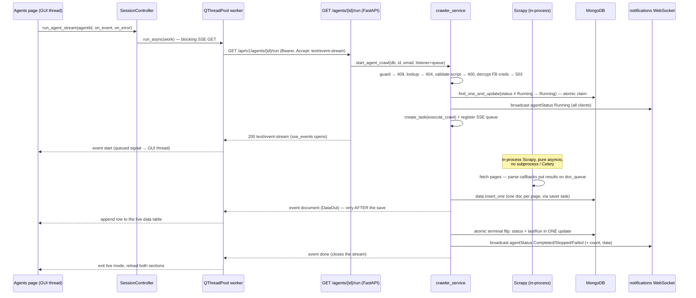

# Agent Run — SSE Streaming Workflow (frontend → backend)

This document describes how `GET /api/v1/agents/{agentId}/run` works end to
end: what the PySide6 desktop client does when you press **Run**, what the
FastAPI backend does with the request, how crawled records stream back live,
and how the run's outcome is tracked.

The endpoint recently changed shape: it used to return `202 Accepted` with the
agent JSON (fire-and-forget — the outcome only arrived via the notifications
WebSocket). It is now a **200 Server-Sent-Events stream**: a `start` event,
one `document` event per crawled page *as it is saved*, keep-alive comments
while idle, and a terminal `done` event that closes the stream. The user who
pressed Run watches records appear one by one; everyone else still gets the
outcome via the WebSocket broadcast.

## The big picture



Two independent channels carry information back:

| Channel | Audience | Carries |
|---|---|---|
| **SSE run stream** (this endpoint) | the requesting client only | live `document` events + terminal `done` |
| **WebSocket** `/api/v1/notifications/ws` | every connected client | `agentStatus` frames (Running/Completed/Stopped/Failed) |

The WebSocket matters even to the runner: if the SSE stream drops or the app
closes, the crawl keeps running server-side and its outcome still lands via
the WS push.

## The SSE contract

The route returns `text/event-stream` with `Cache-Control: no-cache` and
`X-Accel-Buffering: no` (`backend/app/api/routes/agents.py:74-78`). Frames:

| Frame | Payload | When |
|---|---|---|
| `event: start` | `{agentId, agentName, status: "Running"}` | immediately, once the run is claimed |
| `event: document` | `DataOut` JSON (`agentId`, `agentName`, `url`, `fields`, `crawledAt`) | once per crawled page, **only after its Mongo insert succeeds**, in save order |
| `event: done` | `{agentId, agentName, status, runtimeSeconds, count?, lastRun, message?}` | terminal; closes the stream |
| `: keep-alive` | — (comment) | every 15 s of silence (`_SSE_KEEPALIVE_SECONDS`, `crawler_service.py:417`) |

Start errors are raised **before** the stream opens, as ordinary JSON errors
with `{"detail": "..."}` — a client never has to parse errors out of the
stream:

- `401` not authenticated, `404` agent not found
- `409` "Agent is already running" (in-memory registry or DB status guard)
- `400` script not runnable (format not `json`, bad structure, non-http(s)
  links, links over `CRAWL_MAX_PAGES`, non-facebook links on a facebook agent, …)
- `503` stored Facebook credentials cannot be decrypted

## Frontend side (PySide6 desktop app)

### Trigger

The per-row Run button on the Agents page — an icon-only `QPushButton#rowRunButton`
with `play.svg`, no confirmation dialog (`frontend/app/ui/agent_management_page.py:535-552`).
While an agent's status is `Running`, the same cell renders a red Stop button
wired to `_stop_agent` instead.

The click handler `_run_agent` (`agent_management_page.py:591-619`):

1. Guards on busy state and sets the table loading (blocks reload/pagination
   until the stream handshake settles).
2. Enters **live mode** if no other run stream is active and no data fetch is
   in flight: the lower data pane appears for that agent with the subtitle
   `"<agent name> — running…"`, an empty table and a " 0 rows" count.
3. Fires `session.run_agent_stream(agent.id, on_event=…, on_error=…)`.

The run request itself carries **only the agent id** — no body, no parameters.
All crawler configuration lives in the agent record (script, sourceType,
stored credentials) created earlier in the Add/Edit dialog.

### Call chain to the HTTP layer

```text
_run_agent (agent_management_page.py:591)
  └─ SessionController.run_agent_stream (frontend/app/core/session.py:386-453)
       └─ run_async(work, …) — QThreadPool worker (frontend/app/core/worker.py:35-59)
            └─ ApiClient.stream_agent_run (frontend/app/api/client.py:575-635)
                 └─ GET {base_url}/api/v1/agents/{id}/run  (requests, stream=True)
```

Threading rules (the app's golden rule: workers never touch widgets):

- `ApiClient.stream_agent_run` **blocks a worker thread for the whole crawl**.
  It sends `Accept: text/event-stream` + `Authorization: Bearer …` with
  `timeout=(10, None)` (`client.py:594-599`) — connect bounded, read
  unbounded, because the server's keep-alive comments can be up to 15 s apart.
- SSE is parsed by hand (`client.py:604-635`): buffer `event:`/`data:` lines,
  dispatch on the blank line, skip `:`-comment keep-alives. Malformed frames
  parse into None-field events and never raise (`_parse_run_event`,
  `client.py:637-657`).
- A non-200 status raises **before any event fires**. That is what makes the
  auth retry safe: a 401 at the handshake means the crawl never started, so
  `run_agent_stream` refreshes the token once and retries once
  (`session.py:418-438`). A failure *after* events started is surfaced
  without retry or logout — the crawl keeps running server-side.
- Each event crosses to the GUI thread through a `_StreamBridge` QObject
  (queued `Signal(object)`), held alive in `_ACTIVE_STREAMS` and released in
  the `run_async` callbacks (`session.py:34-48, 403-453`).

Base URL: `http://localhost:8000` by default, overridable with the
`DATA_CRAWLER_API_URL` environment variable (`client.py:19, 330-336`).

### What each event does to the UI

`_on_run_stream_event` (`agent_management_page.py:621-657`):

- **`start`** — clears loading and reloads the agents table; the row flips to
  `Running` and its button becomes Stop on repaint.
- **`document`** — appends the just-saved record as the last row of the live
  table (`_append_data_row`, `agent_management_page.py:973-983`): auto-scroll
  to bottom, the "N rows" count grows. Events for a different agent than the
  live one are ignored.
- **`done`** — exits live mode and reloads both sections: the agents row picks
  up the terminal status + `lastRun`, and the canonical newest-first data
  listing replaces the streamed rows.

Failures (`_on_run_failed`, `agent_management_page.py:659-679`): the backend
detail is shown verbatim in the error banner (409 "already running", 400
script-not-runnable, 404 agent gone, dropped stream) and survives the
immediate resync reload. An empty live pane from a failed *start* is dropped;
partial rows from a mid-run stream drop are kept.

### The parallel WebSocket channel

`NotificationClient` (`frontend/app/core/notifications.py:27-115`) keeps a
`QWebSocket` to `/api/v1/notifications/ws?token=…` open for the whole session
(GUI thread, 5 s reconnect, token refresh on handshake rejection).
`MainWindow._on_agent_status` (`frontend/app/ui/main_window.py:128-137`)
adds a bell notification on Completed/Stopped/Failed — e.g. *Agent "X"
completed in N s (M records)* — and refreshes the Agents page on **every**
status frame, so runs started by curl or another user also flip the row live.
A WS (re)connect resyncs too (`main_window.py:139-144`), because frames
broadcast while the socket was down are not replayed.

### Stop

`_stop_agent` (`agent_management_page.py:681-689`) calls
`POST /api/v1/agents/{id}/stop` (`client.py:659-665`). The 202 response still
says `Running`; the Stopped outcome — with partial data — arrives via the WS
broadcast (and the `done` event if the SSE stream is still open).

## Backend side (FastAPI)

### The route

`run_agent` (`backend/app/api/routes/agents.py:62-78`) is thin, per the
codebase layering: it creates an `asyncio.Queue`, delegates to
`crawler_service.start_agent_crawl(db, agent_id, user["email"], listener=queue)`,
and wraps the returned agent doc in `StreamingResponse(crawler_service.sse_events(queue, updated), …)`.
Auth is the standard `CurrentUser` dependency (`backend/app/api/deps.py:34-59`
— Bearer JWT decode + user re-fetch from `users`; non-active → 403).

Note the deliberate quirk: this is a **GET with side effects** (it launches a
crawl and flips DB status). Accepted because the Bearer header keeps
prefetchers/browsers away.

### `start_agent_crawl` — validate, claim, spawn

`backend/app/services/crawler_service.py:486-592`, in order:

1. **In-flight guard** (`:499-504`): the in-memory registry `_running_crawls`
   (`:89`) still holds a live task → `409`. This guard is PATCH-proof: even a
   manual status edit cannot sneak past it.
2. **Lookup** (`:506-510`): `agents.find_one` → `404` if missing.
3. **Run-time script validation** (`:511-529`), branched on `sourceType`:
   - `generic` / `facebook` → `_parse_run_script` (`:251-313`): format must be
     `json`, script a JSON object with a non-empty `links` list of http(s)
     URLs (facebook agents additionally require `https://*.facebook.com`
     links); every other key is a field XPath. The http/https scheme
     allowlist blocks `file:`/internal-scheme SSRF; link count is capped at
     `CRAWL_MAX_PAGES` (default 200).
   - `source_pages` → `_parse_source_pages_run_script` (`:316-337`) — the
     listing-pages/pagination contract instead of `links`.
   - `ecommerce` → `_parse_ecommerce_run_script` (`:340-372`) — seed listings
     plus pagination/product caps.
   - Violations → `400` before anything is claimed.
4. **Facebook credentials decrypt** (`:531-544`): `agent_secret_service.decrypt_for_run`
   Fernet-decrypts the stored cookies/proxies *before* claiming, so a key
   problem fails the request (`503`) instead of the background crawl.
5. **Atomic Running claim** (`:548-558`): `find_one_and_update` with
   `{"_id": …, "status": {"$ne": "Running"}}` — the same idiom as refresh-token
   rotation. Exactly one concurrent run request can win; the loser re-reads
   (`:559-569`) to distinguish 404 (deleted meanwhile) from 409 (already running).
6. **WS broadcast** (`:571-573`): `agentStatus: Running` to every connected
   client via the shared `connection_manager.manager`
   (`backend/app/services/connection_manager.py:42`).
7. **Spawn** (`:575-591`): `asyncio.create_task(execute_crawl(…))`, registered
   in `_running_crawls` **with the SSE queue as a listener, before the task
   spawns** — no document event can be missed in the gap.

Then the route returns the `StreamingResponse`; the generator takes over.

### `sse_events` — the stream body

`crawler_service.py:595-629`. Yields the `start` frame, then loops on
`asyncio.wait_for(queue.get(), timeout=15.0)`; a timeout yields
`": keep-alive\n\n"`; each queued event is framed as
`event: <name>\ndata: <json>\n\n`; the `done` event returns (closing the
stream). The `finally` clause (`:623-629`) unregisters the queue on **any**
exit, including a client disconnect — the crawl itself is unaffected.

### `execute_crawl` — the background crawl

`crawler_service.py:688-975`. No Celery, no subprocess, no Scrapy CLI: the
crawl is an in-process `asyncio.Task` running Scrapy's `AsyncCrawlerRunner`
in pure-asyncio mode (`TWISTED_REACTOR_ENABLED: False`) on uvicorn's event
loop — settings in `_scrapy_settings` (`:375-400`) include
`CLOSESPIDER_TIMEOUT = crawl_timeout_seconds` (600 s) and
`CLOSESPIDER_PAGECOUNT = crawl_max_pages` (200).

- **The saver task** `_persist_and_stream` (`:725-751`) is the heart of the
  streaming design. Spider `parse` callbacks are synchronous, so they only
  `put_nowait` results onto `doc_queue` (`:722-723`); the saver is the single
  consumer: `data_service.build_data_doc` → `data_service.insert_one` into
  the `data` collection (`backend/app/services/data_service.py:20-39`), and
  only a **saved** doc is pushed to every SSE listener as a `document` event
  (`:749-751`, via `_push_event` at `:420-429`). A failed insert records a
  `request_error` failure and is *not* streamed. One consumer ⇒ save order ==
  emit order == crawl order.
- **Spider selection** (`:755-780`): `AgentScriptSpider` (generic XPath
  spider, `:105-181`) / `FacebookPostSpider` (cookies + round-robin proxies,
  gentle pacing) / `EcommerceProductSpider` (two-phase listing → product
  crawl). `source_pages` agents run a Playwright headless-chromium discovery
  phase first (`:785-811`) — randomized 3–120 s listing delays, stop-flag
  aware, bounded by `SOURCE_PAGES_TIMEOUT_SECONDS` — then feed the discovered
  links through the regular spider with the remaining time budget.
- **Stop / truncation accounting** (`:826-870`): links never fetched get
  `cancelled` failure entries.
- **Finalization**: the saver is drained *before* finalizing (no doc can slip
  past), then the terminal status and the `lastRun` summary land in **one
  atomic update** (`_set_agent_status`, `:462-483`; `_build_last_run`,
  `:667-685`). If the agent was deleted mid-crawl, its just-inserted docs are
  orphaned (`data_service.detach_from_agent`) instead of dangling.
- **Terminal broadcast + done** (`:898-927`): a WS frame with `runtimeSeconds`,
  `count`, `lastRun` (ISO strings) and the saved `data`, plus the SSE `done`
  event (`_done_event`, `:432-459`) that closes the requester's stream.
- **Exception path** (`:928-973`): best-effort drain, status `Failed`, WS
  broadcast + SSE done with a message. The task never raises; the `finally`
  always deregisters from `_running_crawls`.

## Status & data tracking

- `agents.status` — `"New" | "Running" | "Completed" | "Stopped" | "Failed"`
  (`backend/app/models/agent.py:28-35`), flipped by the claim and the terminal
  update; `Stopped` is written when a stop was requested (partial data kept).
- `agents.lastRun` — written atomically with the terminal flip:
  `{startedAt, finishedAt, outcome, totalLinks, successCount, failureCount,
  failures: [{url, reason, detail?}]}`, capped at 100 entries
  (`MAX_RECORDED_FAILURES`, `backend/app/models/crawl.py:28`). Failure reasons:
  `broken_link`, `rate_limited`, `http_error`, `login_redirect`, `checkpoint`,
  `cookie_missing`, `timeout`, `dns_error`, `connection_error`, `proxy_error`,
  `unexpected_html`, `cancelled`, `request_error`
  (`backend/app/models/crawl.py:9-36`).
- `data` collection — one document per successfully crawled page
  (`{agentId, agentName, url, fields, crawledAt}`); served newest-first by
  `GET /agents/{agentId}/data` via the `idx_agent_crawled` index.
- `_running_crawls` — the in-flight registry: strong task refs, SSE listener
  queues, `stop_requested` flag, live runner reference (used by `POST .../stop`).

## Related endpoints in the workflow

| Endpoint | Role |
|---|---|
| `POST /api/v1/agents/{id}/stop` | 202; graceful stop — the Stopped outcome arrives via WS/SSE (`agents.py:81-87`) |
| `GET /api/v1/agents/{id}` | carries `lastRun` (the run summary) |
| `GET /api/v1/agents/{id}/data` | paginated per-agent results |
| `GET /api/v1/data/orphaned` | results whose agent was deleted |
| `WS /api/v1/notifications/ws` | `agentStatus` broadcasts for every client |

## Edge cases & quirks

- **A dropped SSE stream does not stop the crawl.** The generator's `finally`
  only unregisters the queue; the run finishes, the data is saved, and the
  outcome still lands via the WS push. The desktop UI keeps any partial live
  rows and resyncs.
- **A server restart kills in-flight crawls.** The lifespan startup sweep
  `reset_interrupted_crawls` (`crawler_service.py:978-1009`) flips orphaned
  `Running` agents to `Failed` so they can be re-run. (uvicorn `--reload`
  counts as a restart.)
- **PATCHing an agent's status to `Running` manually soft-locks runs** — the
  atomic claim excludes `Running`, so every run 409s until it is patched back.
- **Only saved documents stream.** A page whose Mongo insert fails is absent
  from the stream (and the data listing) and appears in `lastRun.failures`
  as `request_error`.
- **Two users pressing Run race safely**: one wins the atomic claim; the
  other gets `409` as an ordinary JSON error before any stream opens.
- `source_pages` rows legitimately stay `Running` for minutes (randomized
  listing delays); see `backend/.claude/rules/api-surface.md` for per-source
  behavior, `ECOMMERCE_CRAWLER_STRATEGY.md` for ecommerce, and
  `FACEBOOK_CRAWLER_FLOW.md` for facebook agents.

## Configuration knobs

| Knob | Default | Effect |
|---|---|---|
| `CRAWL_TIMEOUT_SECONDS` | 600 | `CLOSESPIDER_TIMEOUT` — hard per-run ceiling |
| `CRAWL_MAX_PAGES` | 200 | `CLOSESPIDER_PAGECOUNT` + link-count cap at validation |
| `_SSE_KEEPALIVE_SECONDS` | 15 s | SSE keep-alive comment cadence (constant) |
| `SOURCE_PAGES_TIMEOUT_SECONDS` | 3600 | overall deadline for discovery + article crawl |
| `SOURCE_PAGES_DELAY_MIN/MAX_SECONDS` | 3 / 120 | randomized listing-navigation delays |
| `FACEBOOK_DOWNLOAD_DELAY` | 3.0 | gentle per-request pacing for facebook agents |
| `ECOMMERCE_MAX_PRODUCTS` | 100 | hard unique-product ceiling |
| `DATA_CRAWLER_API_URL` (frontend env) | `http://localhost:8000` | backend base URL |

All backend knobs live in `backend/app/core/config.py` (`:22-48`) and are set
via `.env`; frontend values in `frontend/app/api/client.py`.

## Quick smoke test

```bash
BASE=http://localhost:8000/api/v1
TOKEN=<accessToken from POST $BASE/auth/login>
curl -sN "$BASE/agents/<agentId>/run" -H "Authorization: Bearer $TOKEN"
# → event: start … event: document (one per page) … event: done
```

Try the error paths too: running the same agent twice concurrently → `409`
JSON; running an agent whose script is not a JSON object with `links` → `400`.
