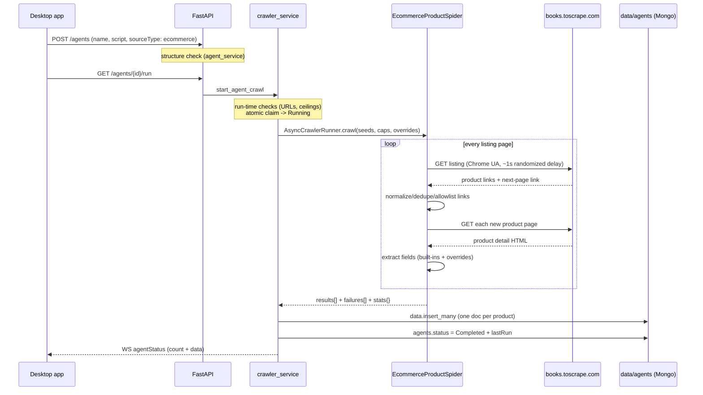

# E-commerce Product Crawling — Strategy & How It Works

This document describes the e-commerce product-crawling strategy end to end:
how the target site was analyzed, how the crawl is structured (listing pages →
product pages → pagination), what gets collected, why runs fail and how to
read the reasons, and how to adapt the built-ins to another shop.

An **e-commerce agent** is an agent with `sourceType: "ecommerce"` (chosen as
"E-commerce products (listing to products)" in the Add/Edit agent dialog).
Unlike a *generic* agent — where you list every page URL by hand — an
e-commerce agent is given **category/listing pages only** and works out the
rest on its own: it discovers product links on every listing page, follows
the listing "next page" link until pagination runs out (or a cap is hit),
and extracts full product fields on each detail page. The generic spider
cannot do any of that; this is the *strategy* this source type adds.

The built-in selectors target [books.toscrape.com](https://books.toscrape.com)
— a stable public sandbox that exists to be scraped — so a fresh install can
crawl a real catalog with nothing but a URL. The reference script used
throughout this document:

```json
{
  "links": ["https://books.toscrape.com/catalogue/category/books/travel_2/index.html"]
}
```

**Read this first — honest caveats:**

- Static-HTML shops only. Pages that build their catalog with JavaScript are
  invisible to this spider — use a `source_pages` agent (Playwright) for
  those, and a `facebook` agent for logged-in collection.
- No login and no anti-bot handling. A shop that needs cookies, throws
  CAPTCHAs, or blocks datacenter IPs will fail with `login_redirect` /
  `checkpoint` / `rate_limited` entries.
- Real shops change their markup. When every product of a run reports
  `unexpected_html`, the built-in selectors went stale — update them or add
  per-field overrides (see [Maintenance](#maintenance--adapting-to-other-shops)).
- Politeness is configured, not negotiable-by-default: one domain at a time,
  a randomized ~1 s delay between requests, 2 concurrent requests,
  AutoThrottle on top (see [Configuration](#configuration)).

## Site analysis: books.toscrape.com

The strategy was designed against this site's actual markup (verified
2026-09-25). It is the ideal first target: static HTML, no login, no
anti-bot, and it explicitly invites scraping.

**Listing pages** (e.g. `/catalogue/category/books/travel_2/index.html`) —
one category shows 20 products per page:

- Each product sits in `<article class="product_pod">`; the detail link is
  `h3 > a` — its `href` is **relative and climbs three levels out of the
  category directory** (`../../../its-only-the-himalayas_981/index.html`
  resolves to `/catalogue/its-only-the-himalayas_981/index.html`).
- Pagination is `<li class="next"><a href="page-2.html">next</a></li>` —
  also relative, but relative **to the category directory**. The `<li>` is
  simply **absent on the last page**: a missing match is the normal end of
  pagination, never a failure.
- The listing already shows price/availability/rating, but only the detail
  page has the full field set (description, category, gallery image), so the
  strategy is **two-phase** rather than listing-scraping.

**Product detail pages** (e.g. `/catalogue/its-only-the-himalayas_981/index.html`):

- `div.product_main` (actually `class="col-sm-6 product_main"` — a
  multi-class attribute, so the built-ins match with `contains()`, never an
  exact `@class` equality): `h1` title, `p.price_color` ("£45.17"),
  `p.instock.availability` ("In stock (19 available)"), `p.star-rating`
  whose **second class word** is the rating ("star-rating Four").
- The category is the last *linked* breadcrumb item (`ul.breadcrumb > li`):
  the final `li` holds the product title and has no `<a>`, so the
  `li[a][last()]` filter picks "Travel", not the title.
- The description is the `<p>` that follows `div#product_description`;
  the image lives in `div#product_gallery`. (The site's own blurb text is
  duplicated inside that `<p>` — that is their data, we store it as-is.)

The relative-URL trap is the one structural gotcha: product hrefs and
pagination hrefs resolve against **different depths**. Every discovered
href is therefore resolved against the page it was found on (via
`normalize_discovered_href` in `backend/app/services/source_pages_discovery.py`,
shared with the source_pages discovery phase), never against a hardcoded
base.

## What gets collected

One `data` document per successfully fetched product page, with these
built-in fields (defined in `backend/app/services/ecommerce_spider.py`).
Each field is an ordered XPath list — books.toscrape first, then generic
`og:` / `itemprop` fallbacks that also match many other static shops:

| Field | Built-in source (first match wins) | Stored as |
|---|---|---|
| `title` | `div.product_main h1` → `og:title` → `h1` → `itemprop=name` | text |
| `price` | `p.price_color` → `product:price:amount` → `itemprop=price` | **numeric string** ("45.17") |
| `currency` | `p.price_color` → `product:price:currency` | ISO code ("GBP" — from the £/$/€ symbol) |
| `availability` | `p.instock.availability` → `itemprop=availability` | text ("In stock (19 available)") |
| `rating` | `p.star-rating/@class` | "1"–"5" (the word class mapped to a digit) |
| `category` | last linked breadcrumb `li` | text ("Travel") |
| `imageUrl` | `#product_gallery img` → `og:image` → `itemprop=image` | absolute URL (joined against the page URL) |
| `description` | `#product_description` sibling `p` → `og:description` → `itemprop=description` | text |
| `productUrl` | *(no XPath)* | the final URL the product was fetched from |

`price`/`currency` come from one extraction split in two because data fields
are flat strings — a nested `{value, currency}` object is not representable.
Any field can be overridden per-agent: a script key with the same name
replaces that field's whole XPath list (facebook-style merge), but the
transform in the table above still applies — an overridden `price` on
another shop still gets its currency symbol parsed out.

A product page where **no field matched at all** produces no document; it
lands in the run summary as an `unexpected_html` failure instead.

## The crawl strategy

The spider (`EcommerceProductSpider`) runs one Scrapy crawl per run, in two
interleaved phases:

1. **Listing phase** — every seed URL is fetched (`parse`). Product links
   are collected from *all* `product_link` XPath matches, resolved to
   absolute URLs, and **deduplicated across every listing page of the run**
   (a product shown on two category pages, or on page 1 and page 2, is
   fetched once). Each new product URL becomes a detail request.
2. **Pagination** — after queueing a listing page's products, the first
   `next_page` match is fetched as the next listing (repeat phase 1). A
   missing next link ends the seed's pagination normally. Two guards keep
   this finite: every visited listing URL is remembered (a circular
   `next` chain cannot loop), and `max_next` caps the navigations per seed.
3. **Product phase** — every product response (`parse_product`) is parsed
   into the field set above and appended to the run's results.

Safety and politeness layers, inside-out:

- **Seed-host allowlist**: product/next links are only followed when their
  hostname exactly matches a seed's hostname. An off-site href (ad, CDN
  link, partner site) is silently skipped — predictable and safe. (`www.`
  vs apex counts as different hosts; seed with the host the site links
  with.)
- **`max_products`** — cap on unique discovered products per run. When the
  cap is reached the spider *stops discovering* and lets the already
   scheduled requests drain, so the run finishes with exactly the cap (no
   silently discarded queue). The truncation is recorded as one `cancelled`
   entry. Default `100` (`ECOMMERCE_MAX_PRODUCTS`); a script may set a
   lower value, never higher.
- **`max_next`** — pagination navigations per seed (default: until the
  next link disappears).
- **`CRAWL_MAX_PAGES` / `CRAWL_TIMEOUT_SECONDS`** — the global Scrapy
  `CLOSESPIDER` valves (default 200 pages / 600 s). They count listing AND
  product pages: a 110-book category is ~116 pages, so a full-category run
  fits; a whole-site crawl would truncate, and the truncation is made
  visible as a `cancelled` entry rather than a silent short count.
- **Pacing** — browser User-Agent, `DOWNLOAD_DELAY` 1 s randomized
  ±50%, 2 concurrent requests per domain, AutoThrottle. Single-page bursts
  are not possible by configuration.

## Script reference

| Key | Required | Type | Default | Meaning |
|---|---|---|---|---|
| `links` | yes | non-empty list of URL strings | — | seed category/listing URLs (http/https) |
| `product_link` | no | XPath string or list | books.toscrape built-in | product-link XPaths on listing pages |
| `next_page` | no | XPath string or list | books.toscrape built-in (`li.next`) | pagination link XPath |
| `max_next` | no | integer ≥ 1 | unlimited | pagination navigations per seed (`max_next_page` tolerated alias — supplying both is a 400) |
| `max_products` | no | integer ≥ 1 | `ECOMMERCE_MAX_PRODUCTS` (100) | unique-product cap per run (capped at the setting) |
| *any other key* | no | XPath string or list | built-in field set | per-field XPath override |

Minimal script: `{"links": ["<listing url>"]}` — everything else has a
working default for books.toscrape.com. Full example:

```json
{
  "links": ["https://books.toscrape.com/catalogue/category/books/nonfiction_13/index.html"],
  "product_link": "//article[contains(@class,'product_pod')]//h3/a/@href",
  "next_page": "//li[@class='next']/a/@href",
  "max_next": 2,
  "max_products": 25,
  "title": "//h1/text()"
}
```

Rejections (HTTP 400, at **create/update** for structure, at **run** for
URLs and ceilings):

| Trigger | When | Detail |
|---|---|---|
| `links` missing / not a non-empty list of strings | both | `script 'links' must be a non-empty list of URL strings` |
| a field / `product_link` / `next_page` not an XPath or list of XPaths | both | `script field 'title' must be a non-empty XPath string or a non-empty list of XPath strings` |
| both `max_next` and `max_next_page` | both | `script cannot contain both 'max_next' and 'max_next_page'` |
| `max_next` / `max_products` not an integer ≥ 1 (`true` counts as invalid) | both | `script 'max_next' must be an integer of at least 1` (resp. `max_products`) |
| a seed is not http/https | run | `link '…' is not a supported http/https URL` |
| more seeds than `CRAWL_MAX_PAGES` | run | `script has more than 200 links (CRAWL_MAX_PAGES)` |
| `max_products` above `ECOMMERCE_MAX_PRODUCTS` | run | `script 'max_products' cannot exceed 100 (ECOMMERCE_MAX_PRODUCTS)` |

Scripts must use `format: json` (like every source). The desktop dialog
mirrors the structure checks client-side with the exact messages above.

## End-to-end pipeline



Key files: `backend/app/services/ecommerce_spider.py` (spider, plan parser,
price/rating helpers, settings overlay), `backend/app/services/crawler_service.py`
(`_parse_ecommerce_run_script`, the `execute_crawl` wiring, lastRun
accounting), `backend/app/models/agent.py` (`AgentSource.ECOMMERCE`), and
`backend/app/services/source_pages_discovery.py` (shared
`normalize_discovered_href` / UA / XPath-list helpers).

## Failure reasons

Same vocabulary as the other sources (`app/models/crawl.py`), with
ecommerce-specific meaning:

| Reason | When |
|---|---|
| `broken_link` | a seed listing or product page returned 404 |
| `rate_limited` / `http_error` | 429 / any other non-2xx on either phase |
| `timeout` / `dns_error` / `connection_error` | network-level failure on either phase; other seeds/products continue |
| `unexpected_html` (listing) | 200 OK but **zero product links matched** — the `product_link` XPath (or the site's markup) went stale, or the seed is not a listing page |
| `unexpected_html` (product) | 200 OK but no field matched — the field selectors went stale |
| `cancelled` (cap) | `stopped after 25 unique products (max_products)` — the run completed with the cap |
| `cancelled` (budget) | the global page/time budget closed the crawl with products still queued — raise the caps or narrow the seeds |
| `cancelled` (stop) | the stop button landed with products still unfetched; partial data is kept |

## lastRun accounting

- `totalLinks` = **unique discovered product links** (not the seed count) —
  matching the source_pages convention of counting discovered links. An
  empty/broken run where nothing was discovered falls back to the seed count.
- `successCount` = product pages that produced a `data` document.
- `failureCount` = listing failures + product failures + the cap/budget/stop
  `cancelled` entries above.

## Configuration

| Env var | Default | Purpose |
|---|---|---|
| `ECOMMERCE_DOWNLOAD_DELAY` | `1` | seconds between requests (randomized 0.5–1.5×) |
| `ECOMMERCE_CONCURRENT_REQUESTS` | `2` | concurrent requests per domain |
| `ECOMMERCE_MAX_PRODUCTS` | `100` | hard ceiling on unique products per run (a script's `max_products` may lower it, never raise it) |
| `CRAWL_TIMEOUT_SECONDS` | `600` | hard run ceiling (shared with all sources) |
| `CRAWL_MAX_PAGES` | `200` | page cap per run, listings + products (shared) |

No browser install is needed (unlike source_pages) — this is plain HTTP.

## Maintenance & adapting to other shops

Override order, cheapest first:

1. **Per-field script overrides** — replace one field's XPath list via the
   script (no code change). `"price": "//span[@class='money']/text()"`.
2. **`product_link` / `next_page` overrides** — point the listing phase at
   the new shop's markup. If the shop paginates with a button instead of a
   link, it is a JS shop → use a source_pages agent instead.
3. **Built-in updates** — when a shop is worth default support, extend the
   fallback lists in `_BUILT_IN_FIELDS` (put site-specific XPaths first,
   keep the generic `og:`/`itemprop` tail).

Drift signals to watch: every listing reporting `unexpected_html` =
`product_link` is stale; every product reporting it = field selectors are
stale (check one failing URL by hand). JSON-LD (`application/ld+json`
Product schema) is deliberately not parsed in v1 — it needs script-block
JSON parsing and nested traversal, and the og:/itemprop fallbacks already
cover most static shops; it is the natural next enhancement.

## How to run & verify

```bash
# backend up (no --reload: it kills in-flight crawls)
cd backend && docker compose up -d
.venv/bin/pytest tests/                       # pure-helper tests green
.venv/bin/uvicorn app.main:app --port 8000
curl -s localhost:8000/api/health             # {"status":"ok","database":"up"}

BASE=http://localhost:8000/api/v1
# signup/login per verification.md, then:
curl -s -X POST $BASE/agents -H "Authorization: Bearer $TOKEN" \
  -H 'Content-Type: application/json' -d '{
    "name":"books-travel","format":"json","sourceType":"ecommerce",
    "script":"{\"links\":[\"https://books.toscrape.com/catalogue/category/books/travel_2/index.html\"]}"}'
curl -s $BASE/agents/<id>/run -H "Authorization: Bearer $TOKEN"      # 202
# poll GET $BASE/agents?limit=1 → Completed; expect totalLinks 11, success 11
curl -s "$BASE/agents/<id>/data?limit=20" -H "Authorization: Bearer $TOKEN"
```

Expected for the Travel category: 11 records, every field populated
(`price` "26.08"-style, `currency` "GBP", `rating` "1"–"5", absolute
`imageUrl`). The pagination/caps path: seed the Nonfiction category
(110 books) with `{"max_next": 2, "max_products": 25}` → exactly 25
records, `totalLinks` 25, one `cancelled` cap entry.

In the desktop app: Add agent → Source "E-commerce products" → paste the
script → run with the row's play button; records appear in the lower data
pane, the Fields viewer shows one product's full field set.
