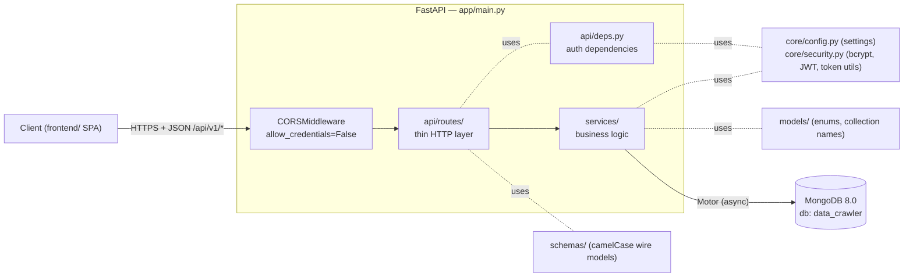
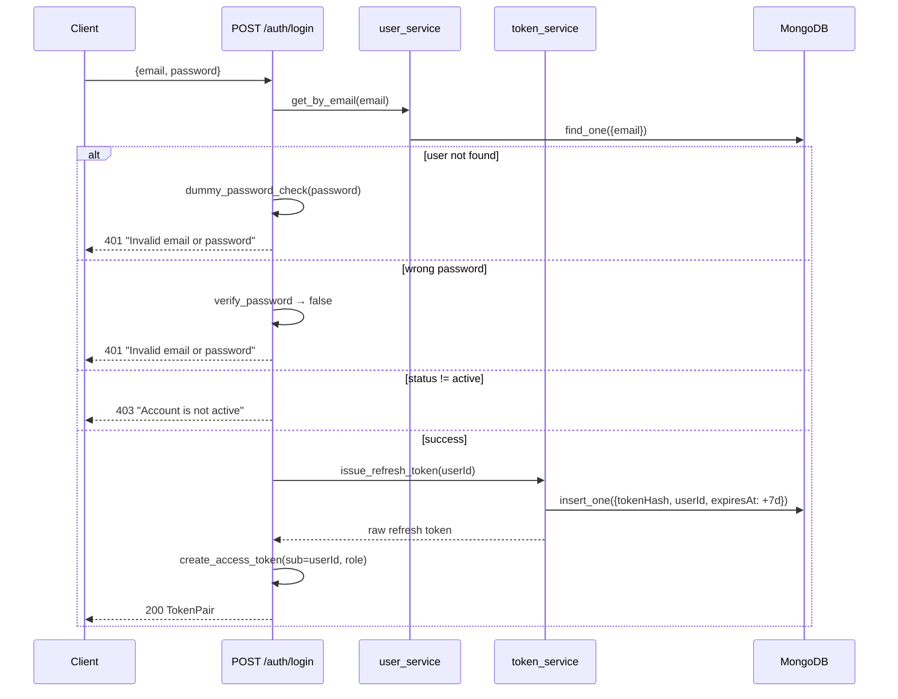
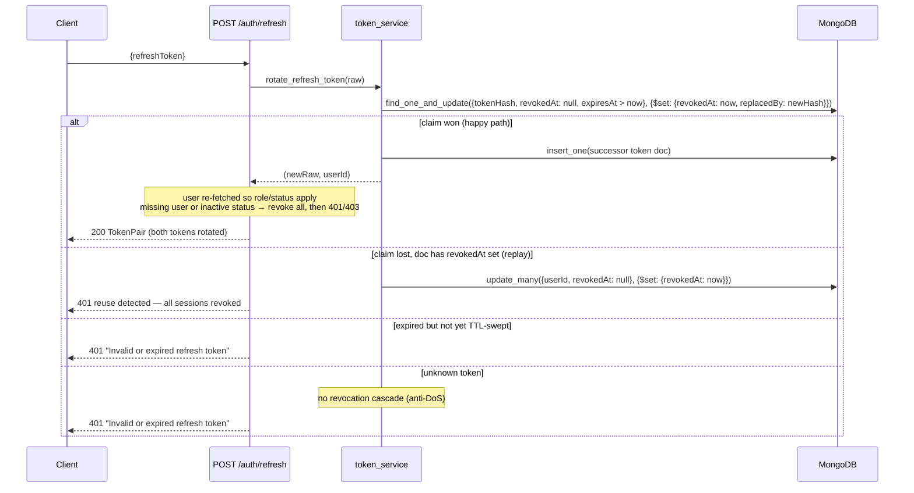
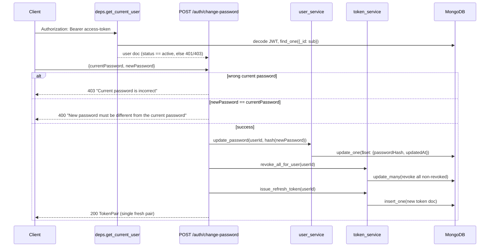
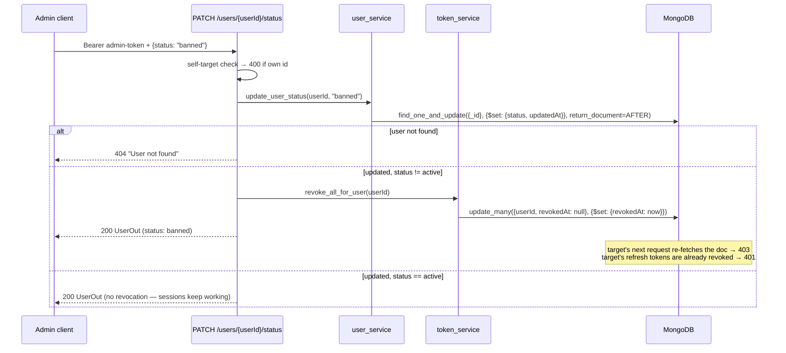

---
paths:
  - "app/**"
---

# Architecture (Full Reference)

## System context



## Layering

Request flow: `api/routes` → `services` → MongoDB via Motor. Config and primitives
live in `core/`.

| Layer | Directory | Responsibility |
|---|---|---|
| HTTP | `app/api/routes/` | Parse request, authorize (via `deps`), call a service, map to a response schema. No collection access here. |
| Auth DI | `app/api/deps.py` | `get_current_user` / `get_current_admin`, `DbDep`, `CurrentUser`, `AdminUser` |
| Business logic | `app/services/` | The only layer that touches Mongo. Returns plain dicts (Mongo documents). |
| Data | `app/db/mongo.py` | Motor client lifecycle, `ensure_indexes()`, `get_db` |
| Primitives | `app/core/` | `config.py` (pydantic-settings), `security.py` (bcrypt, JWT, refresh-token utils) |
| Wire contracts | `app/schemas/` | Pydantic models with camelCase aliases (`_CamelModel`, `UserOut`) |
| Constants | `app/models/` | `UserRole`, `UserStatus`, collection-name constants |

Mapping to response models happens only at the route boundary via
`UserOut.from_doc` — this is where `passwordHash` is dropped and `_id` becomes `id`.

## Application lifecycle (`app/main.py`)

- **Lifespan startup** (`init_mongo`): create `AsyncIOMotorClient(settings.mongodb_uri)`
  (never at import time) → `admin.command("ping")` to fail fast on unreachable host or
  bad credentials → stash client/db on `app.state` → `ensure_indexes(db)` →
  `crawler_service.reset_interrupted_crawls` (flips agents orphaned in `Running` by a
  restart to `Failed`).
- **Lifespan shutdown** (`close_mongo`): `client.close()` if present.
- **Middleware**: only `CORSMiddleware` — `allow_origins=settings.cors_origins_list`,
  `allow_credentials=False` (Bearer headers, not cookies), `allow_methods=["*"]`,
  `allow_headers=["*"]`.
- **Routers**: `auth.router` (`/auth`, tag `auth`), `users.router` (`/users`, tag
  `users`), `agents.router` (`/agents`, tag `agents`), `data.router` (`/data`,
  tag `data` — data deletes), and `notifications.router`
  (`/notifications`, tag `notifications` — one WebSocket endpoint), all mounted
  with `prefix="/api/v1"`.
- **Health**: `GET /api/health` (unversioned) pings Mongo and reports
  `{"status": "ok", "database": "up" | "down"}`.

## Directory map

```
app/
├── main.py                   # FastAPI app: lifespan (Mongo connect + indexes), CORS, routers
├── core/config.py            # Settings from .env; @lru_cache get_settings(); SettingsDep
├── core/security.py          # hash_password, verify_password, dummy_password_check,
│                             # create_access_token, decode_access_token,
│                             # generate_refresh_token, hash_refresh_token
├── db/mongo.py               # init_mongo / close_mongo, ensure_indexes, get_db
├── models/user.py            # UserRole, UserStatus, USERS_COLLECTION, REFRESH_TOKENS_COLLECTION
├── models/agent.py           # AgentType, AgentFormat, AgentStatus, AGENTS_COLLECTION
├── models/data.py            # DATA_COLLECTION
├── schemas/auth.py           # SignupRequest, LoginRequest, RefreshTokenRequest,
│                             # LogoutRequest, ChangePasswordRequest, TokenPair
├── schemas/user.py           # UserOut (+ from_doc boundary)
├── schemas/agent.py          # AgentOut/AgentCreate/AgentUpdate/AgentList
├── schemas/data.py           # DataOut/DataList + delete request/result (+ from_doc boundary)
├── services/user_service.py  # create_user, get_by_email, get_by_id, update_password
├── services/token_service.py # issue/rotate/revoke refresh tokens, reuse detection
├── services/agent_service.py # agent CRUD, _validate_script (json format check)
├── services/crawler_service.py    # AgentScriptSpider, start_agent_crawl/execute_crawl,
│                             # run-script validation, startup Running sweep
├── services/data_service.py  # build_data_docs + insert_many (crawl results), list_by_agent,
│                             # delete_one / delete_many
├── services/connection_manager.py # shared WS registry (manager.broadcast)
└── api/
    ├── deps.py               # bearer_scheme, DbDep, WsDbDep, CurrentUser, AdminUser (admin guard)
    └── routes/               # auth.py (5 endpoints), users.py (GET /users/me + 5 admin endpoints),
│                             # agents.py (7 agent endpoints, CurrentUser), data.py (2 data endpoints),
│                             # notifications.py (1 WS endpoint)
```

## Token architecture

| | Access token | Refresh token |
|---|---|---|
| Format | JWT, HS256 | Opaque 384-bit (`secrets.token_urlsafe(48)`) |
| Lifetime | 15 min (`ACCESS_TOKEN_EXPIRE_MINUTES`) | 7 days (`REFRESH_TOKEN_EXPIRE_DAYS`) |
| Transport | `Authorization: Bearer <token>` | JSON body (`refreshToken`) |
| Storage | Stateless (not stored server-side) | MongoDB, **SHA-256 hash only** (`tokenHash`) |
| Claims | `sub` (user id), `role`, `type: "access"`, `iat`, `exp` | n/a |

Key behaviors:

- The JWT is decoded statelessly, but `get_current_user` **re-fetches the user from the
  DB on every request** — bans/status changes apply immediately, and `role` comes from
  the DB doc, not the JWT claim.
- The raw refresh token is shown to the client exactly once; only its hash is stored.
- Refresh rotation is atomic: `find_one_and_update` with
  `{tokenHash, revokedAt: None, expiresAt: {$gt: now}}` — concurrent refreshes with the
  same token have exactly one winner.
- Replaying a revoked token revokes **all** of that user's refresh tokens (family
  revocation). Unknown tokens do **not** cascade (anti-DoS).

## Sequence: login



## Sequence: refresh (rotation + reuse detection)



## Sequence: change password



## Sequence: admin bans a user



Role changes (`PATCH /users/{userId}/role`) follow the same shape minus the
revocation step — `get_current_user` re-reads the DB doc, so a demotion costs the
target their privileges on their very next request despite the stale JWT `role`
claim.

## Sequence: run agent crawl

```mermaid
sequenceDiagram
    participant C as Client
    participant R as GET /agents/{id}/run
    participant S as crawler_service
    participant WS as connection_manager
    participant SC as Scrapy (AsyncCrawlerRunner)
    participant DB as MongoDB

    C->>R: Bearer token
    R->>S: start_agent_crawl(db, agentId, email)
    S->>S: _parse_run_script (400 unless json + links + xpath fields)
    S->>DB: find_one_and_update({status != Running} → Running)
    alt claim lost
        R-->>C: 409 (already running) / 404 (deleted)
    else claimed
        S->>WS: broadcast agentStatus Running
        S->>S: asyncio.create_task(execute_crawl)
        R-->>C: 202 AgentOut (Running)
        Note over SC: in-process, pure asyncio<br/>(TWISTED_REACTOR_ENABLED=False)
        SC->>SC: GET each link; per field try XPaths in order
        SC-->>S: results [{url, fields}]
        S->>DB: data.insert_many (skipped when 0 items)
        S->>DB: status → Completed (or Failed on crash)
        S->>WS: broadcast agentStatus Completed + count + data
    end
```

In-flight tasks live in `crawler_service._running_crawls` (strong refs +
second re-run guard); the task's `finally` always deregisters. A server restart
kills the crawl — the lifespan startup sweep flips orphaned `Running` agents to
`Failed` so they can be re-run.

## Dependency injection (`app/api/deps.py`, `app/core/config.py`)

- `DbDep` — `Annotated[AsyncIOMotorDatabase, Depends(get_db)]`; `get_db` returns
  `request.app.state.mongo_db`. `WsDbDep` is the WebSocket twin (`get_db_ws` reads
  `websocket.app.state.mongo_db` — `Request` is not injectable in WS routes).
- `CurrentUser` — `Annotated[dict, Depends(get_current_user)]`; returns the fresh user
  doc for any authenticated-user endpoint.
- `AdminUser` — `Annotated[dict, Depends(get_current_admin)]`; 403 "Admin
  privileges required" unless the DB role is `admin`. Used by the five admin
  routes: `GET /users`, `PATCH /users/{userId}/status`, `PATCH /users/{userId}/role`,
  `DELETE /users/{userId}`, `DELETE /users` (bulk).
- `SettingsDep` — `@lru_cache`d `get_settings()`; never `os.getenv`, never
  instantiate `Settings()` elsewhere.
- `bearer_scheme = HTTPBearer(auto_error=False)` — a missing header becomes the
  custom 401 "Not authenticated", not FastAPI's default 403.

## Error & auth conventions

- All 401s from deps carry `WWW-Authenticate: Bearer`.
- Login returns an identical generic `401 "Invalid email or password"` for unknown
  email and wrong password; unknown email runs `dummy_password_check()` (timing
  equalization — no account enumeration).
- Specific service exceptions (`RefreshTokenReuseError`, `RefreshTokenError`) are
  translated to HTTP responses in the route, not in the service.
- Password checks order on login: existence → password → status (a banned user with a
  wrong password gets 401, not 403).

Security invariants live in `security-auth.md`; data-layer details in
`database-schema.md`; the endpoint/status-code table in `api-surface.md` and
`project-overview.md`.
